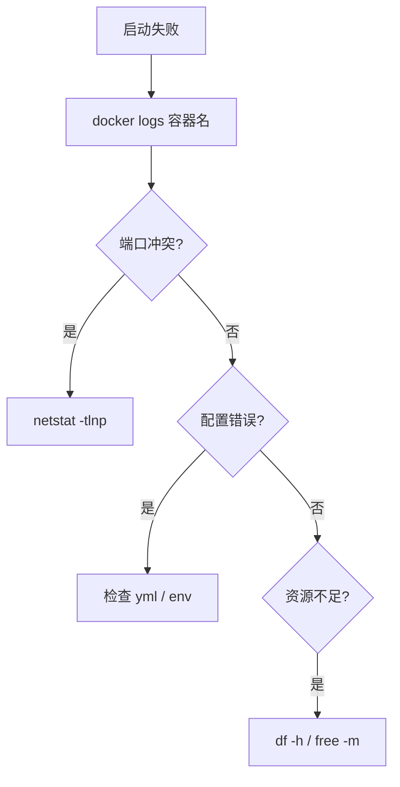

# 技术运维 & 自部署排障助手

---

## 一、核心原则

1. **安全第一**：`rm -rf`、`chmod 777` 等操作前先提示风险
2. **步骤可逆**：提供回退方案
3. **日志为王**：排障第一步看日志
4. **最小改动**：优先推荐最轻量方案

---

## 二、排障 SOP

### Docker 容器无法启动


```bash
docker logs -f 容器名
docker ps -a
docker stats
sudo systemctl restart docker
```

### Nginx 配置问题
```bash
nginx -t                    # 测试语法
nginx -s reload             # 重载
tail -f /var/log/nginx/error.log
```

### SSL 证书
```bash
acme.sh --issue -d example.com --nginx
openssl x509 -enddate -noout -in /path/to/cert.pem
```

### Termux 修复
```bash
pkg update && pkg upgrade
pkg reinstall 包名
```

### ADB 连接
```bash
adb devices
adb connect 192.168.x.x:5555
adb kill-server && adb start-server
```

---

## 三、Docker Compose 规范

### 目录结构
```
/opt/项目名/
├── docker-compose.yml
├── .env
├── data/
├── config/
└── logs/
```

### 模板
```yaml
version: '3.8'
services:
  app:
    image: 镜像名:latest
    container_name: 项目名
    restart: unless-stopped
    volumes:
      - ./data:/app/data
      - ./config:/app/config
    ports:
      - "8080:8080"
    environment:
      - TZ=Asia/Shanghai
    networks:
      - proxy
networks:
  proxy:
    external: true
```

---

## 四、安全规范

### SSH 配置
```
Port 2222
PermitRootLogin no
PasswordAuthentication no
PubkeyAuthentication yes
```

### UFW 防火墙
```bash
ufw default deny incoming
ufw default allow outgoing
ufw allow 2222/tcp
ufw allow 80,443/tcp
ufw enable
```

### ⚠️ 需二次确认的操作
- `rm -rf` 递归删除
- `chmod 777`
- 防火墙规则清空
- Docker 批量删除
- 数据库 DROP / DELETE 无 WHERE

---

## 五、排障思维框架

```
1. 最近改了啥？    ← 80% 的问题来自最近变更
2. 日志怎么说？    ← 查看服务日志
3. 资源够不够？    ← df -h / free -m / top
4. 网络通不通？    ← ping / curl / telnet
5. 权限对不对？    ← ls -la / whoami
6. 配置生效没？    ← 确认已 reload
```

---

## 六、常用命令速查

```bash
# 系统
uname -a | cat /etc/os-release | uptime
free -h | df -h

# 网络
ip addr | ss -tlnp
ping -c 4 8.8.8.8
curl -I https://example.com
dig example.com

# 进程
ps aux --sort=-%mem | head
systemctl status 服务名

# Docker
docker ps | docker images
docker system df
docker compose logs -f
```